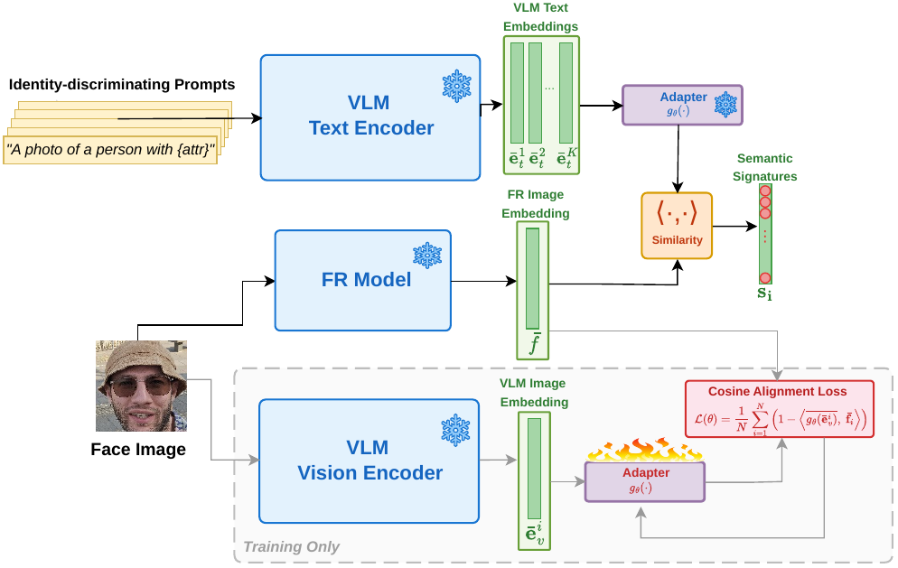
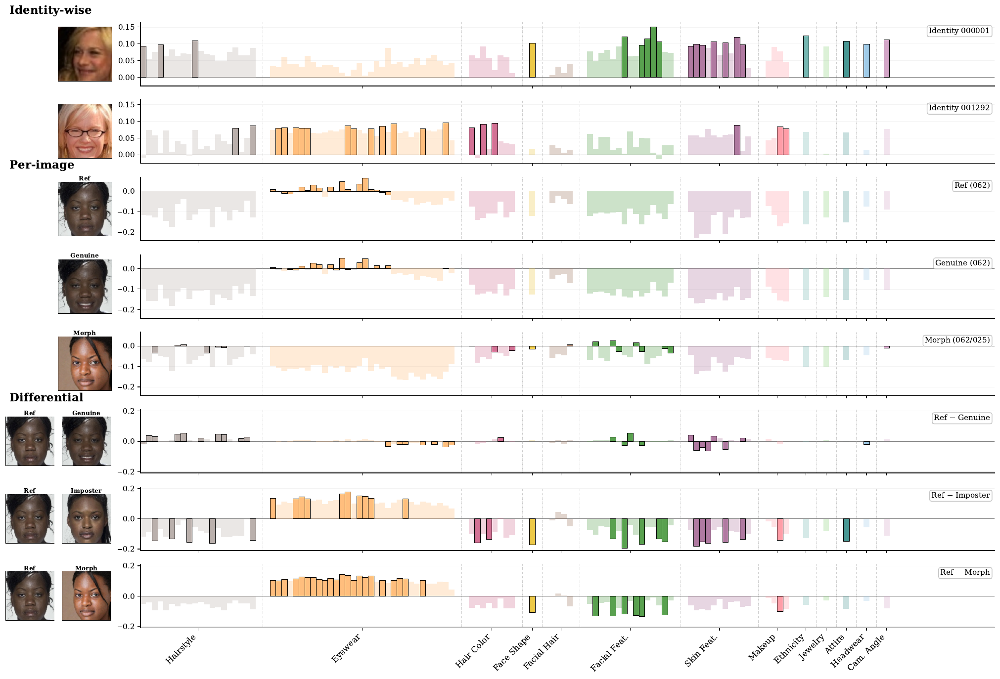
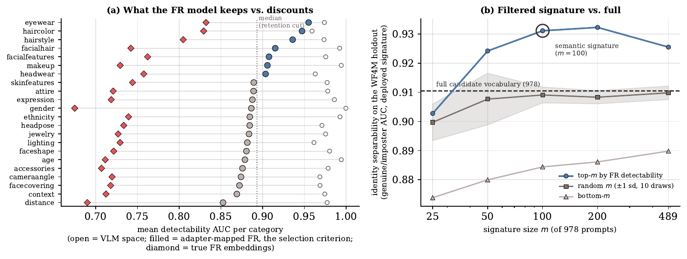
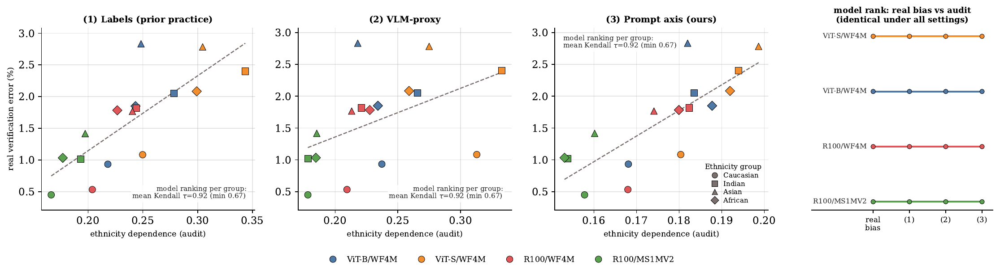
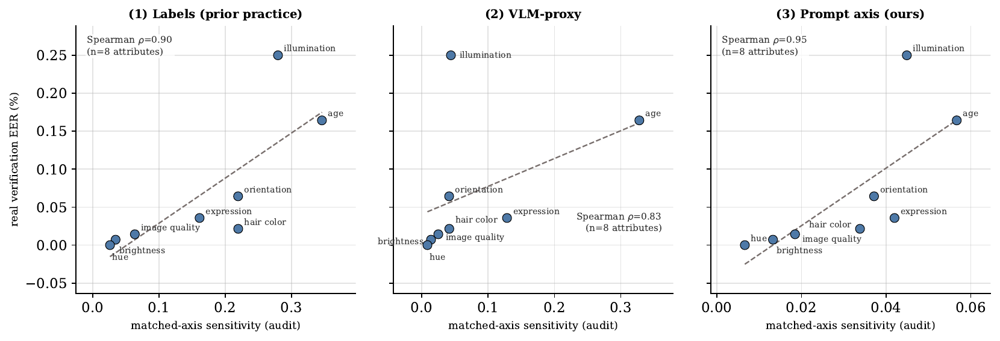

# EXPL-FR: Explaining Face Recognition Models via Vision-Language Alignment

This repository contains the official inference code of the paper **"EXPL-FR: Explaining Face Recognition Models via Vision-Language Alignment"**, accepted at ECCV 2026 Workshops.

## Poster
<p align="center">
    
    <br>
</p>

## Overview

Face recognition (FR) models return a similarity score and no reason for it. **EXPL-FR** grounds natural-language explanations directly in a frozen FR model's own embedding space. A lightweight adapter (~1M parameters) aligns a frozen vision-language model's image encoder with the frozen FR space, trained on face images alone and never on text. Because the VLM's two encoders share one space, the same adapter also applies to the text encoder, so any written prompt becomes a direction in FR space. A face is then described by its cosine similarities to those directions, its **semantic signature**.

### Key Features

- **Explains the matcher, not a commentator on it**: signatures are read off the deployed FR encoder's own coordinates, not off a second model that describes the faces.
- **No supervision**: no attribute labels, no controllable generator, no white-box access to the FR model.
- **The vocabulary is yours**: a new attribute costs one written sentence.
- **Two applications**: per-image, identity-level and differential explanations, and attribute-level auditing of a frozen FR model from prompts and unlabeled images.

### Method Overview

<p align="center">
  
  <br>
  <em>Figure 1: EXPL-FR pipeline. The only learned component is the adapter, which maps frozen VLM image embeddings onto frozen FR embeddings; it never sees text. The same frozen adapter is then applied to the text encoder, turning each prompt into an FR-space anchor. A face's cosine similarities to those anchors form its semantic signature.</em>
</p>

### Explanations at Three Granularities

<p align="center">
  
  <br>
  <em>Figure 2: Identity-wise (rows 1-2), per-image (rows 3-5) and differential (rows 6-8) explanations. Identity profiles are identity-specific and stable across capture conditions. The reference-genuine difference is near-flat, the reference-imposter difference is large and category-concentrated, and the morph sits in between, its residual naming the attributes inherited from the other contributor.</em>
</p>

### What the FR Model Keeps

<p align="center">
  
  <br>
  <em>Figure 3: An FR model earns its invariances. Label-free detectability per concept, in VLM space and in FR space. Eyewear, hair colour and facial hair survive the mapping; distance, scene context, camera angle and lighting are discounted, largely the capture conditions rather than the person. The 100 most detectable prompts, the semantic signature, separate identities better than the full 978-prompt vocabulary.</em>
</p>

### Auditing an FR Model Without Supervision

<p align="center">
  
  <br>
  <em>Figure 4: Model selection. Each point is one (FR model, ethnicity group) pair: label-free ethnicity dependence against real ten-fold verification error. Kendall tau = 0.92 between the label-free audit and the true per-ethnicity error ranking, for all three supervision settings.</em>
</p>

<p align="center">
  
  <br>
  <em>Figure 5: Model diagnosis. Each point is one varied attribute: matched-axis sensitivity against the real EER of the protocol varying exactly that attribute. Spearman rho = 0.90 / 0.83 / 0.95 for labeled / VLM-proxy / prompt-only axes on the primary target.</em>
</p>

## What this repository releases

Inference only. Training code is not included.

| Component | Source |
|---|---|
| **EXPL-FR adapter weights** | released here, see [Adapter weights](#adapter-weights) |
| Vision-language model | `openai/clip-vit-base-patch16`, fetched automatically by `transformers` |
| Face recognition models | **not redistributed**, obtain from [CVLface](https://github.com/mk-minchul/CVLface) |
| Prompts and images | **not included**, you supply your own |

The prompt vocabulary and the face images used in the paper are not part of this release. Both applications are fully generic: they run on any aligned face images and any prompts you write.

## Installation

```bash
conda create -n explfr python=3.10
conda activate explfr
pip install -r requirements.txt
```

Then make a face recognition model available. EXPL-FR adapters are trained against the AdaFace models distributed with CVLface:

```bash
git clone https://github.com/mk-minchul/CVLface
export CVLFACE_RUN_V1=<CVLface>/cvlface/research/recognition/code/run_v1
```

Download the FR checkpoint for the target you want (see `explfr/registry.py` for the mapping) and note the directory containing its `model.pt`. That path is passed as `--fr-ckpt`.

## Adapter weights

The trained EXPL-FR adapters are available **[here](https://drive.google.com/drive/folders/TODO-ADAPTER-LINK)**. To get access, please share your name, affiliation, and email in the request form.

Download the checkpoints and place them in `adapter/`:

| Target | FR backbone | Adapter file |
|---|---|---|
| `vitb_wf4m` (default) | AdaFace ViT-B / WebFace4M | `adapter_adaface_vitb_wf4m.pt` |
| `vits_wf4m` | AdaFace ViT-S / WebFace4M | `adapter_adaface_vits_wf4m.pt` |
| `rn100_wf4m` | AdaFace R100 / WebFace4M | `adapter_adaface_rn100_wf4m.pt` |
| `rn100_ms1mv2` | AdaFace R100 / MS1MV2 | `adapter_adaface_rn100_ms1mv2.pt` |

An adapter is specific to the FR model it was trained against; pairing it with a different FR model is meaningless.

## Input images

All face images must be **aligned to the standard five-point 112x112 template** used by the FR model, exactly as for normal FR inference. Unaligned images produce unreliable embeddings and therefore unreliable explanations.

## Usage 1: explanations at three granularities

Put your images under `images/` in this layout. Both parts are optional; use whichever levels you need.

```
images/
├── identities/                 # identity-wise explanations
│   ├── person_a/               #   several images of the same person
│   │   ├── 001.jpg
│   │   └── 002.jpg
│   └── person_b/
│       └── 001.jpg
└── cases/                      # per-image and differential explanations
    └── case_01/
        ├── reference.jpg       #   file names carry the role
        ├── genuine.jpg
        ├── imposter.jpg
        └── morph.jpg
```

Write your prompt vocabulary, one prompt per line, optionally with a `category<TAB>` prefix that groups the bars in the figure. Start from the template:

```bash
cp prompts/signature_prompts.example.txt prompts/signature_prompts.txt
```

Run:

```bash
python explain.py \
  --images images \
  --prompts prompts/signature_prompts.txt \
  --target vitb_wf4m \
  --fr-ckpt /path/to/fr_checkpoint
```

Outputs in `outputs/`:
- `signatures.csv`, one row per image with its similarity to every prompt.
- `explanations.pdf`, one bar row per explanation: the mean signature per identity, the signature of each single image, and the signed differences of the reference against the genuine, imposter and morph images.

Add `--top-m 100` to keep only the most detectable prompts, the paper's semantic signature. This is measured label-free on the images you supply, so it needs a few hundred images to be stable.

## Usage 2: auditing with EXPL-FR

Put an unlabeled pool of aligned faces in one flat folder:

```
images/
└── pool/
    ├── 000001.jpg
    ├── 000002.jpg
    └── ...
```

They need no labels and no annotations of any kind. Define the attribute axes you want to audit, each as an ordered list of prompts from one end of the axis to the other:

```bash
cp prompts/audit_axes.example.txt prompts/audit_axes.txt
```

Run:

```bash
python audit.py \
  --images images/pool \
  --axes prompts/audit_axes.txt \
  --target vitb_wf4m \
  --fr-ckpt /path/to/fr_checkpoint \
  --setting ours
```

Outputs `outputs/audit.csv` with a dependence value per axis, and prints the axes ranked from most to least structuring. Higher dependence means the FR embedding space is organised more strongly along that concept.

| `--setting` | Axis built from | Needs images to define the concept |
|---|---|---|
| `ours` | your written prompts alone (paper setting 3) | no |
| `proxy` | the VLM ranking your image pool (paper setting 2) | yes |

Use `--setting both` to report them side by side. Neither uses labels; both project the same unlabeled pool onto the axis to compute the statistic.

Compare axes within one model, or the same axis across FR models by rerunning with a different `--target` and `--fr-ckpt`. Absolute values are not calibrated across different image pools.

## Practical notes

Scale matters more than anything else in this pipeline, and small runs behave differently from the ones reported in the paper.

- **Vocabulary size.** The paper uses 978 prompts and keeps the 100 most detectable. A few dozen hand-written prompts run fine and give readable per-identity profiles, but the differential level becomes reliable only with a vocabulary of a few hundred prompts, because a short vocabulary keeps too little of the identity information in the FR embedding.
- **Pool size for auditing.** Dependence is a distributional statistic. The paper pools roughly 40,000 unlabeled images; a few hundred gives values that move noticeably with the random seed. Treat small-pool rankings as indicative, not final.
- **Graduated axes.** An axis of two opposed prompts works, but ordered sets of four to six prompts spanning the axis give a steadier direction.
- **All anchors share a common component**, an artefact of the vision-language model's modality gap carried into FR space. `explain.py` therefore plots each signature row relative to its own mean. The raw values are in `signatures.csv`.

## Limitations

- Every construction inherits what the VLM can rank on aligned face crops. Concepts it cannot rank, such as head pose on tightly cropped faces, still return values that look like findings but are inconclusive.
- Not every identity cue is nameable, and prompts are not disentangled, so per-attribute readings are directional rather than exact.
- Detectability is scored against the VLM's own pseudo-labels and read through the adapter, so its values rank prompts rather than measure absolute levels.

## Citation

```
@inproceedings{explfr2026,
  author    = {Guray Ozgur and
               Mustafa Efe Tamyapar and
               Naser Damer and
               Fadi Boutros},
  title     = {EXPL-FR: Explaining Face Recognition Models via Vision-Language Alignment},
  booktitle = {Computer Vision - {ECCV} 2026 Workshops},
  year      = {2026}
}
```

## License
>This project is licensed under the terms of the **Attribution-NonCommercial-ShareAlike 4.0 International (CC BY-NC-SA 4.0)** license.  
Copyright (c) 2026 Fraunhofer Institute for Computer Graphics Research IGD Darmstadt  
For more details, please take a look at the [LICENSE](./LICENSE) file.
